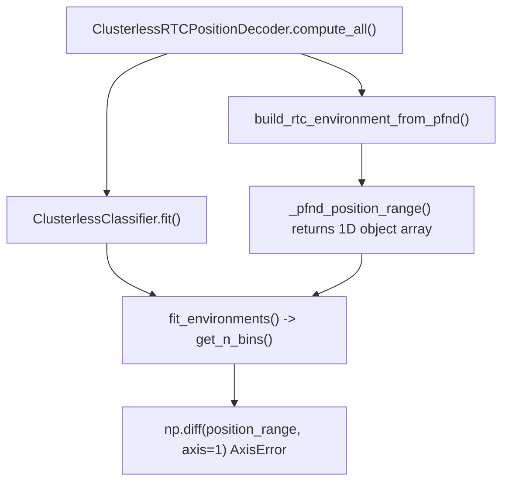

# Fix Clusterless Decoder AxisError in `fit()`

## Root cause

The traceback points to [`rtc_clusterless_decoder.py`](h:\TEMP\Spike3DEnv_ExploreUpgrade\Spike3DWorkEnv\pyPhoPlaceCellAnalysis\src\pyphoplacecellanalysis\Analysis\Decoder\rtc_clusterless_decoder.py) line 85 (`classifier.fit(...)`), but the failure happens earlier inside RTC's `fit_environments()` → `Environment.fit_place_grid()` → `get_n_bins()`:

```224:225:H:\TEMP\Spike3DEnv_ExploreUpgrade\Spike3DWorkEnv\pyPhoPlaceCellAnalysis\.venv\lib\site-packages\replay_trajectory_classification\environments.py
    if position_range is not None:
        extent = np.diff(position_range, axis=1).squeeze()
```

RTC requires `position_range` with shape `(n_position_dims, 2)` — each row is `[low, high]` for one spatial dimension. It is also passed to `np.histogramdd(..., range=position_range)`.

The adapter currently builds the wrong structure in [`rtc_clusterless_adapters.py`](h:\TEMP\Spike3DEnv_ExploreUpgrade\Spike3DWorkEnv\pyPhoPlaceCellAnalysis\src\pyphoplacecellanalysis\Analysis\Decoder\rtc_clusterless_adapters.py):

```33:42:h:\TEMP\Spike3DEnv_ExploreUpgrade\Spike3DWorkEnv\pyPhoPlaceCellAnalysis\src\pyphoplacecellanalysis\Analysis\Decoder\rtc_clusterless_adapters.py
def _pfnd_position_range(pf: PfND) -> Optional[np.ndarray]:
    ...
    if pf.ndim == 1:
        ...
        return np.array([bounds_1d, None], dtype=object)   # shape (2,) — 1D object array
    ...
    return np.array([x_bounds, y_bounds], dtype=object)  # shape (2,) — also 1D
```

For a typical PfND 1D config like `grid_bin_bounds = ((25.5, 257.9), (89.1, 131.9))`, this becomes `array([(25.5, 257.9), None], dtype=object)` — **1-dimensional**, so `axis=1` is invalid.



## Fix (single-file change)

Update `_pfnd_position_range()` in [`rtc_clusterless_adapters.py`](h:\TEMP\Spike3DEnv_ExploreUpgrade\Spike3DWorkEnv\pyPhoPlaceCellAnalysis\src\pyphoplacecellanalysis\Analysis\Decoder\rtc_clusterless_adapters.py) to return a float array of shape `(n_dims, 2)`:

**1D (`pf.ndim == 1`)**
- Use NeuroPy's existing helper: `pf.config.grid_bin_bounds_1D` (already normalizes scalar / nested tuple formats to `(min, max)`).
- Return `np.asarray(bounds_1d, dtype=float).reshape(1, 2)`.

**2D (`pf.ndim == 2`)**
- Standard nested format `((xmin, xmax), (ymin, ymax))`: `np.stack([x_bounds, y_bounds], axis=0)` → shape `(2, 2)`.
- Optional defensive branch for flat 4-tuple `(xmin, ymin, xmax, ymax)` (used in some Bapun helpers): reshape to `[[xmin, xmax], [ymin, ymax]]`.

**Fallback**
- Keep returning `None` when `grid_bin_bounds` is `None` so RTC infers extent from position data (existing simulation tests rely on this path).

No changes needed in [`rtc_clusterless_decoder.py`](h:\TEMP\Spike3DEnv_ExploreUpgrade\Spike3DWorkEnv\pyPhoPlaceCellAnalysis\src\pyphoplacecellanalysis\Analysis\Decoder\rtc_clusterless_decoder.py) or [`DefaultComputationFunctions.py`](h:\TEMP\Spike3DEnv_ExploreUpgrade\Spike3DWorkEnv\pyPhoPlaceCellAnalysis\src\pyphoplacecellanalysis\General\Pipeline\Stages\ComputationFunctions\DefaultComputationFunctions.py) once `position_range` is correct.

## Tests

Add cases to [`tests/test_rtc_clusterless_decoder.py`](h:\TEMP\Spike3DEnv_ExploreUpgrade\Spike3DWorkEnv\pyPhoPlaceCellAnalysis\tests\test_rtc_clusterless_decoder.py):

1. **`test_pfnd_position_range_shapes`** — mock `PfND` configs and assert:
   - 1D nested bounds → shape `(1, 2)`
   - 1D flat `(min, max)` pair → shape `(1, 2)`
   - 2D nested bounds → shape `(2, 2)`
   - `np.diff(result, axis=1)` succeeds (regression guard for the exact failure mode)

2. **`test_build_rtc_environment_fit_place_grid`** — build `Environment` from a mock PfND, call `fit_place_grid(position)` with synthetic `(n_time, n_dims)` position; should not raise.

Run: `uv run pytest tests/test_rtc_clusterless_decoder.py -q`

## Verification in notebook

After the fix, re-run:

```python
curr_active_pipeline.perform_specific_computation(
    computation_functions_name_includelist=['position_decoding_clusterless'],
    ...
)
```

`pf1D_ClusterlessDecoder` and `pf2D_ClusterlessDecoder` should complete `compute_all()` without AxisError.
