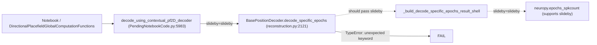

# Fix `decode_specific_epochs` missing `slideby` parameter

## Root cause

Recent continuous-decoding work added `slideby` support at the **call sites** and in NeuroPy's `epochs_spkcount`, but not in the decoder API itself.



**Current signature** (no `slideby`):

```2121:2132:h:\TEMP\Spike3DEnv_ExploreUpgrade\Spike3DWorkEnv\pyPhoPlaceCellAnalysis\src\pyphoplacecellanalysis\Analysis\Decoder\reconstruction.py
def decode_specific_epochs(self, spikes_df: pd.DataFrame, filter_epochs, decoding_time_bin_size:float=0.05, use_single_time_bin_per_epoch: bool=False, debug_print=False) -> DecodedFilterEpochsResult:
    ...
    pre_built_epochs_decoding_result = self.pre_build_epochs_decoding_result(spikes_df=spikes_df, filter_epochs=filter_epochs, decoding_time_bin_size=decoding_time_bin_size, use_single_time_bin_per_epoch=use_single_time_bin_per_epoch, debug_print=debug_print)
```

**Call site that fails** (passes `slideby`):

```5983:5983:h:\TEMP\Spike3DEnv_ExploreUpgrade\Spike3DWorkEnv\pyPhoPlaceCellAnalysis\src\pyphoplacecellanalysis\SpecificResults\PendingNotebookCode.py
all_context_filter_epochs_decoder_result: DecodedFilterEpochsResult = contextual_pf2D_Decoder.decode_specific_epochs(..., decoding_time_bin_size=active_laps_decoding_time_bin_size, slideby=slideby, debug_print=False)
```

NeuroPy already supports sliding windows:

```480:491:h:\TEMP\Spike3DEnv_ExploreUpgrade\Spike3DWorkEnv\NeuroPy\neuropy\analyses\decoders.py
def epochs_spkcount(..., slideby: Optional[float]=None) -> ...:
    ...
    slideby (float, optional): Step between sliding-window start times in seconds. If None, hop equals ``bin_size`` (standard non-overlapping bins).
```

Your notebook call with `time_bin_size=0.500` and default `slideby=None` will behave as today (non-overlapping 500 ms bins) once the kwarg is accepted and forwarded.

## Implementation (single file, minimal surface area)

All changes in [`reconstruction.py`](h:\TEMP\Spike3DEnv_ExploreUpgrade\Spike3DWorkEnv\pyPhoPlaceCellAnalysis\src\pyphoplacecellanalysis\Analysis\Decoder\reconstruction.py).

### 1. Add `slideby` to `DecodedFilterEpochsResult`

After `decoding_time_bin_size` (~line 891), add:

```python
slideby: Optional[float] = serialized_attribute_field(default=None)
```

- `None` means non-overlapping bins (`hop == decoding_time_bin_size`), matching [`decoding_continuous_cache_key`](h:\TEMP\Spike3DEnv_ExploreUpgrade\Spike3DWorkEnv\pyPhoPlaceCellAnalysis\src\pyphoplacecellanalysis\General\Pipeline\Stages\ComputationFunctions\MultiContextComputationFunctions\DirectionalPlacefieldGlobalComputationFunctions.py) semantics.

### 2. Thread `slideby` through the decode-specific-epochs pipeline

Add `slideby: Optional[float] = None` to each method and pass it through:

| Method | Line (approx) |
|--------|----------------|
| `decode_specific_epochs` | 2121 |
| `pre_build_epochs_decoding_result` | 2135 |
| `_build_decode_specific_epochs_result_shell` | 2327 |
| `perform_decode_specific_epochs` | 2559 |

In `_build_decode_specific_epochs_result_shell`, the critical change is forwarding to binning:

```python
spkcount, included_neuron_ids, n_tbin_centers, time_bin_containers_list = epochs_spkcount(
    filter_epoch_spikes_df, epochs=filter_epochs, bin_size=decoding_time_bin_size,
    slideby=slideby, export_time_bins=True, included_neuron_ids=neuron_IDs,
    use_single_time_bin_per_epoch=use_single_time_bin_per_epoch, debug_print=debug_print)
```

Also set on the shell container (~line 2383):

```python
filter_epochs_decoder_result.slideby = slideby
```

No changes needed in [`PendingNotebookCode.py`](h:\TEMP\Spike3DEnv_ExploreUpgrade\Spike3DWorkEnv\pyPhoPlaceCellAnalysis\src\pyphoplacecellanalysis\SpecificResults\PendingNotebookCode.py) or [`DirectionalPlacefieldGlobalComputationFunctions.py`](h:\TEMP\Spike3DEnv_ExploreUpgrade\Spike3DWorkEnv\pyPhoPlaceCellAnalysis\src\pyphoplacecellanalysis\General\Pipeline\Stages\ComputationFunctions\MultiContextComputationFunctions\DirectionalPlacefieldGlobalComputationFunctions.py) — they already pass `slideby` correctly.

### 3. Add a small unit test

In [`tests/test_decoders.py`](h:\TEMP\Spike3DEnv_ExploreUpgrade\Spike3DWorkEnv\pyPhoPlaceCellAnalysis\tests\test_decoders.py), add a lightweight test (no H5 fixture required) that:

1. Instantiates a minimal decoder or mocks `_build_decode_specific_epochs_result_shell` / calls `decode_specific_epochs` with `slideby=0.05` and asserts no `TypeError`.
2. Optionally asserts returned `DecodedFilterEpochsResult.slideby == 0.05`.

Existing `test_variable_slideby` already covers `epochs_spkcount`; this test guards the API wiring.

## Verification

After implementation, re-run the failing notebook cell:

```python
curr_active_pipeline.perform_specific_computation(
    computation_functions_name_includelist=['directional_decoders_decode_continuous'],
    computation_kwargs_list=[{'time_bin_size': 0.500, 'should_disable_cache': False}],
    enabled_filter_names=None, fail_on_exception=True, debug_print=False)
```

Expected: computation completes; cache key `(0.5, 0.5)` for default `slideby=None`.

Run targeted tests:

```bash
cd pyPhoPlaceCellAnalysis && uv run pytest tests/test_decoders.py -q
```

## Out of scope (separate follow-up)

[`PredictiveDecodingComputations.py`](h:\TEMP\Spike3DEnv_ExploreUpgrade\Spike3DWorkEnv\pyPhoPlaceCellAnalysis\src\pyphoplacecellanalysis\General\Pipeline\Stages\ComputationFunctions\MultiContextComputationFunctions\PredictiveDecodingComputations.py) calls `DecodedFilterEpochsResult.init_from_single_epoch_result(..., slideby=hop_arg)` but thatclassmethod does not exist in `reconstruction.py`. That is unrelated to your current traceback but will fail if you run predictive-decoding filtering with cache keys.
