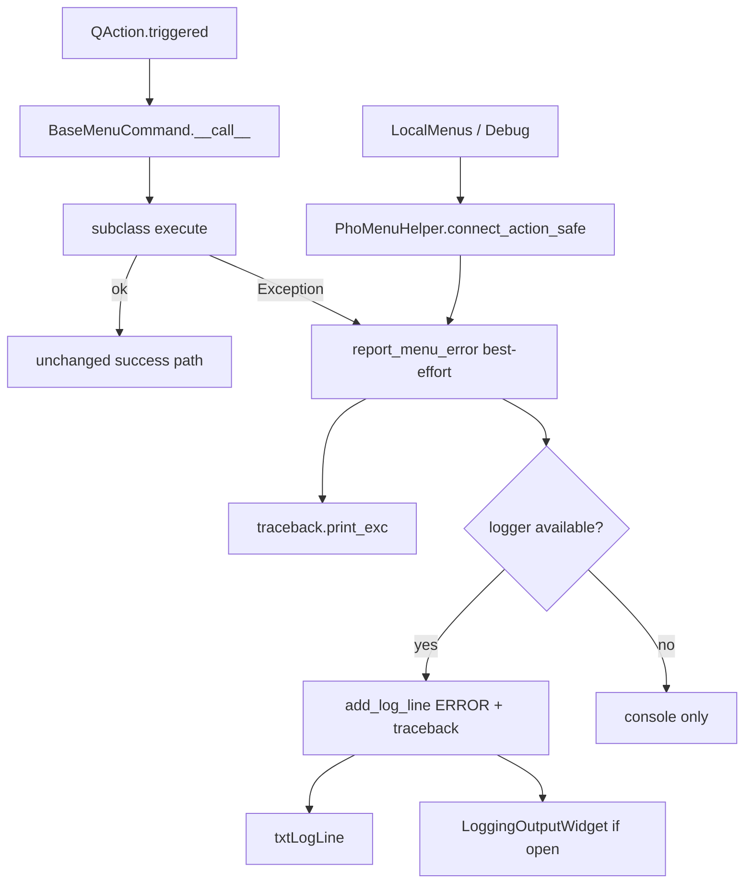

# Menu Error Logging + Safe Log UI Repair

## Goals
- Menu failures (e.g. Docked Widgets → Pseudo2D Positions) stop failing silently.
- Errors appear in the existing bottom playback bar log (`txtLogLine` + optional `LoggingOutputWidget`).
- No regressions for standalone / non-interactive `Spike2DRaster` usage, programmatic APIs, or successful menu actions.

## Non-goals / hard safety constraints
- Do **not** change `Spike2DRaster` rendering, scrolling, docking, or signal wiring.
- Do **not** add a `QStatusBar` or modal error dialogs for routine menu failures.
- Do **not** wrap arbitrary Qt slots or Spike2DRaster callbacks — only menu invocation paths.
- Error reporting must be **best-effort and never raise**: missing window, missing bottom bar, missing logger, destroyed widgets, or headless contexts must fall back to `traceback.print_exc()` / `print` only.

## Architecture

## Implementation

### 1. Central menu exception wrapper
File: [`src/pyphoplacecellanalysis/GUI/Qt/Menus/BaseMenuProviderMixin.py`](src/pyphoplacecellanalysis/GUI/Qt/Menus/BaseMenuProviderMixin.py)

- Change `BaseMenuCommand.__call__` to wrap `self.execute(...)` in `try/except Exception`.
- On failure call a new `report_menu_error(exc, command_identifier=...)` helper, then **return** (do not re-raise) so Qt stays alive and the failure is visible.
- `report_menu_error` must:
  - Always `traceback.print_exc()` (parity with `pyqtExceptionPrintingSlot`).
  - Resolve logger only via guarded attribute access, e.g. `getattr(self, '_spike_raster_window', None)` then `getattr(window, 'bottom_playback_control_bar_logger', None)` / widget `add_log_line`.
  - Catch **all** reporting failures internally (`except Exception: pass` after console print) so reporting never becomes a second crash.
  - Format: short line `ERROR [menu:<id>]: <exc>` plus traceback lines via `add_log_line(..., allow_split_newlines=True)`.

This covers Docked Widgets / Create Connected / Create Paired / decoder plot commands without editing each `execute()`.

### 2. Safe connect helper for non-command menus
File: [`src/pyphoplacecellanalysis/GUI/Qt/Menus/PhoMenuHelper.py`](src/pyphoplacecellanalysis/GUI/Qt/Menus/PhoMenuHelper.py)

- Add `PhoMenuHelper.connect_action_safe(action, callback, *, error_context=None, spike_raster_window=None)` that wraps any callable with the same best-effort report path.
- Migrate only menu `triggered.connect` sites that are **not** `BaseMenuCommand`:
  - [`LocalMenus_AddRenderable.py`](src/pyphoplacecellanalysis/GUI/Qt/Menus/LocalMenus_AddRenderable/LocalMenus_AddRenderable.py)
  - [`DebugMenuProviderMixin.py`](src/pyphoplacecellanalysis/GUI/Qt/Menus/SpecificMenus/DebugMenuProviderMixin.py)
- Leave existing `BaseMenuCommand` connects as-is (covered by `__call__`).

### 3. Repair bottom log UI (required for visibility)
File: [`src/pyphoplacecellanalysis/GUI/Qt/PlaybackControls/Spike3DRasterBottomPlaybackControlBarWidget.py`](src/pyphoplacecellanalysis/GUI/Qt/PlaybackControls/Spike3DRasterBottomPlaybackControlBarWidget.py)

Fix `toggle_log_window` without changing default layout/visibility:
- Use `btnToggleExternalLogWindow.isChecked()` (current code treats the widget as a bool).
- If checked and window is `None`: create `LoggingOutputWidget`, connect once, show, seed with current log text.
- If checked and window exists: `show()` / raise.
- If unchecked and window exists: `hide()` (do not destroy; keep connections).
- Remove the duplicate `sigLogUpdated.connect` (currently connected twice).
- Guard against deleted C++ objects (`RuntimeError` / `AttributeError`) when showing/hiding.

Logging write path:
- Menu errors call `add_log_line` directly (already not gated by `debug_print`) — keep that.
- Do **not** change `log_print`'s `debug_print` gating for ordinary playback chatter (avoids flooding `txtLogLine` in normal use).
- Ensure `on_log_updated` still updates `txtLogLine` for the last few entries.

Optional polish only if cheap: prefix error lines with `ERROR:` so they stand out in the single-line preview.

### 4. Regression / non-interactive safety checklist
Explicitly avoid these failure modes:

| Risk | Mitigation |
|------|------------|
| Standalone `Spike2DRaster` without window/bottom bar | Logger lookup is optional; console fallback only |
| Programmatic `command.execute()` outside GUI | Same defensive report path; no new required attrs |
| Swallowing bugs during development | Still print full traceback to console |
| Double-wrapping / changed success behavior | Only wrap failure path; success path unchanged |
| Log toggle crash on reopen | Fix `isChecked` + reuse existing window |
| Accidental Spike2DRaster changes | Do not edit Spike2DRaster.py for this feature |
| Headless / tests without display | No new widgets created except when user toggles log button |

### 5. Verification
Manual / interactive (SpikeRasterWindow):
1. Open window; confirm `txtLogLine` and log button still present and unchanged when idle.
2. Toggle log button: open → close → open again; window must reappear with prior log text.
3. Trigger a known-failing Docked Widgets item; expect `ERROR [...]` in `txtLogLine` and full traceback in `LoggingOutputWidget`; window must not freeze/crash.
4. Trigger a known-working menu item; behavior unchanged.

Non-interactive / regression smoke:
1. Import / construct `Spike2DRaster` paths used by non-window display functions — no new imports or side effects from menu helper changes at import time.
2. Unit-test style (no GUI if possible): call a dummy `BaseMenuCommand` subclass whose `execute` raises, with `_spike_raster_window=None`; assert no exception escapes `__call__` and console reporting still runs.
3. Same with a mock window lacking `bottom_playback_control_bar_logger`.

## Key files
- [`BaseMenuProviderMixin.py`](src/pyphoplacecellanalysis/GUI/Qt/Menus/BaseMenuProviderMixin.py) — `__call__` wrapper + `report_menu_error`
- [`PhoMenuHelper.py`](src/pyphoplacecellanalysis/GUI/Qt/Menus/PhoMenuHelper.py) — `connect_action_safe`
- [`Spike3DRasterBottomPlaybackControlBarWidget.py`](src/pyphoplacecellanalysis/GUI/Qt/PlaybackControls/Spike3DRasterBottomPlaybackControlBarWidget.py) — log toggle / connection repair
- [`LocalMenus_AddRenderable.py`](src/pyphoplacecellanalysis/GUI/Qt/Menus/LocalMenus_AddRenderable/LocalMenus_AddRenderable.py), [`DebugMenuProviderMixin.py`](src/pyphoplacecellanalysis/GUI/Qt/Menus/SpecificMenus/DebugMenuProviderMixin.py) — migrate lambda connects

## Out of scope
- Wiring the currently unwired Connections menu actions
- Fixing root causes of specific Pseudo2D menu failures (this work only surfaces them)
- Changing `pyqtExceptionPrintingSlot` in external `pyphocorehelpers`